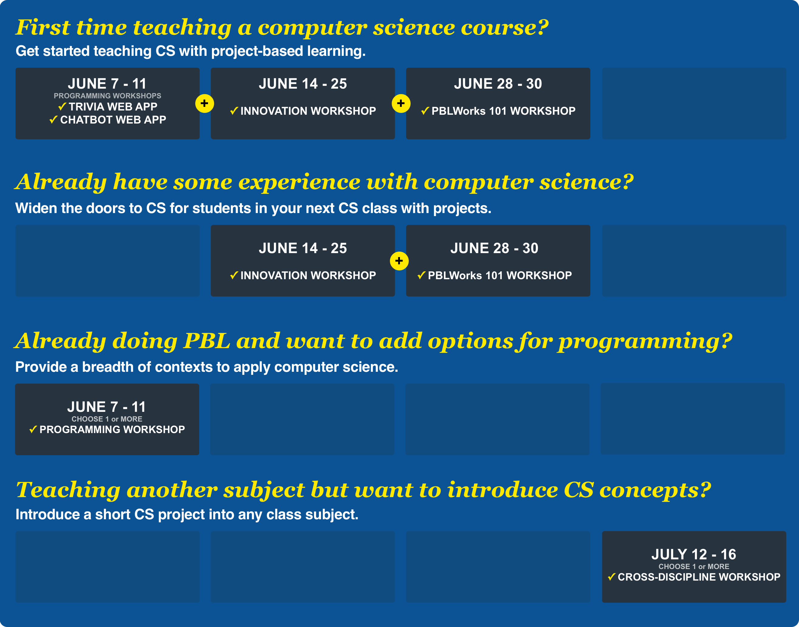

# Computing by Design 2021

## Welcome to Our 2021 Online Summer Workshop Series!  

**Customize a path that aligns with your needs in teaching computer science**. Computing by Design \(CxD\) offers an array of professional development opportunities to prepare you for teaching your first CS class, enhancing your current curriculum, or simply incorporating CS principles in another subject. Sign up for one or any combination of workshops.

**Enjoy your summer activities while preparing for computer science.** All workshops are offered online and are designed to take approximately 2 hours each day \(\*\), providing you flexibility in your summer schedule. You will have constant access to the online material and access to an online Slack community of instructors and fellow teachers. Each week there will be two one-hour Zoom meetings for guest interviews, questions and sharing workshop progress.

### Recommended Workshop Pathways  👇 

While you can customize which workshops you take, here are a few recommendations to consider if you are unsure where to start. **If you have questions or want more guidance on how to proceed, please** [**contact Vicki Daugherty**](mailto:%20vdaugher@iupui.edu)**.**

### Workshops Schedule Overview

<table>
  <thead>
    <tr>
      <th style="text-align:left">Workshops</th>
      <th style="text-align:left">Length/Dates</th>
    </tr>
  </thead>
  <tbody>
    <tr>
      <td style="text-align:left">
        
&lt;b&gt;&lt;/b&gt;<a href="programming-workshops/choose-programming-workshop.md"><b>Six Programming Workshops</b></a>&lt;b&gt;&lt;/b&gt;

        
Choose from Trivia, Robot, Video Game, Chatbot, IoT, and Data Viz programming.

      </td>
      <td style="text-align:left">
        
<b>One Week</b>
        

        
June 7-11

      </td>
    </tr>
    <tr>
      <td style="text-align:left">
        
&lt;b&gt;&lt;/b&gt;<a href="cxd-innovation-workshop/full-experience.md"><b>&#x2605; Innovation Workshop &#x2605;</b></a>&lt;b&gt;&lt;/b&gt;

        
Prepare for a full computer science experience with projects.

      </td>
      <td style="text-align:left">
        
<b>Two Weeks</b>
        

        
June 14 - 23

      </td>
    </tr>
    <tr>
      <td style="text-align:left">
        
&lt;b&gt;&lt;/b&gt;<a href="pblworks-101-workshop/classroom.md"><b>PBLWorks PBL 101 Workshop</b></a>&lt;b&gt;&lt;/b&gt;

        
All about planning classroom management and assessments for projects.

      </td>
      <td style="text-align:left">
        
<b>Three Full Days</b>
        

        
June 28 - 30

      </td>
    </tr>
    <tr>
      <td style="text-align:left">
        
&lt;b&gt;&lt;/b&gt;<a href="cs-short-workshops/short-projects.md"><b>Six Cross-Discipline Workshops</b></a>&lt;b&gt;&lt;/b&gt;

        
Choose from six short projects that blend computer science into other
          disciplines.

      </td>
      <td style="text-align:left">
        
<b>One Week</b>
        

        
July 12 - 16

      </td>
    </tr>
  </tbody>
</table>

### **Stand Alone Computer Science Activities for K-12** 

A repository of computer science activities with an emphasis on K-8 coming soon! The first 20 activities will be released by July 2021 with regular additions made through summer 2022.  A link to the repository coming soon. 

### Teacher Stipends💲 

**Teachers will be provided stipends on the following schedule each summer.**

* $250 dollars per participation in a one-week workshop \(items 1, 3 and 5\)
* $500 dollars per participation in the two-week CxD Innovation Workshop \(item 2\)

The maximum total stipend in a summer workshop series will not exceed $1000 per teachers. In order to receive a stipend for the Classroom Management and Project Assessments Workshop \(PBLWorks\) the teacher must also participate in at least one other workshop to ensure sufficient coverage of computer science content. 

**The following are required to receive the stipend for each workshop.**

* Participation in all live online sessions for the given workshop
* Participation in the online Slack community
* Complete associated surveys
* Submission of a final deliverable that demonstrates competency in the workshop content

