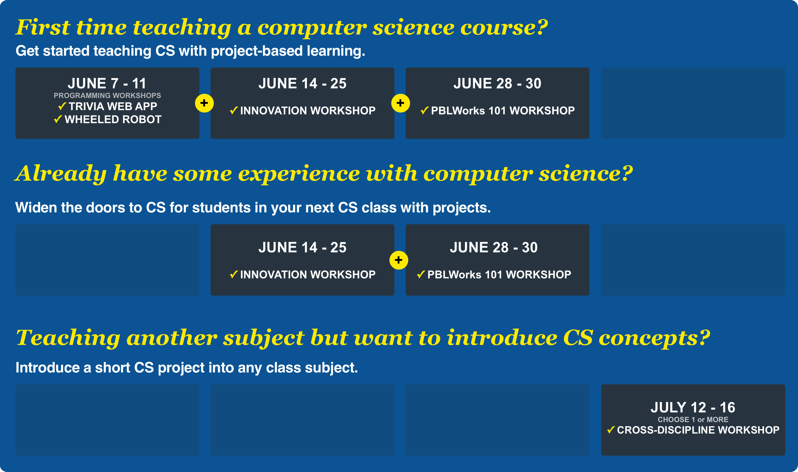

# Computing by Design 2021

## Welcome to Our 2021 Online Summer Workshop Series! 👋 

**Enjoy your summer activities while preparing for computer science.** All workshops are offered online and designed to take **approximately 2 hours each day of the workshop \(\*\)**, providing you flexibility in your summer schedule and allowing you to customize a path that aligns with your needs in teaching computer science.  _\* Exception: The PBLWorks workshop is 3 full days online._

### Recommended Pathways 👈 

We understand that your situation may be very unique. Here are a few recommended pathways to consider, but you can customize your choices to fit your needs.

### Workshops Schedule Overview

<table>
  <thead>
    <tr>
      <th style="text-align:left">Workshops</th>
      <th style="text-align:left">Length/Dates</th>
    </tr>
  </thead>
  <tbody>
    <tr>
      <td style="text-align:left">
        
&lt;b&gt;&lt;/b&gt;<a href="programming-workshops/choose-programming-workshop.md"><b>Six Programming Workshops</b></a>&lt;b&gt;&lt;/b&gt;

        
Choose from Trivia, Robot, Video Game, Chatbot, IoT, and Data Viz programming.

      </td>
      <td style="text-align:left">
        
<b>One Week</b>
        

        
June 7-11

      </td>
    </tr>
    <tr>
      <td style="text-align:left">
        
&lt;b&gt;&lt;/b&gt;<a href="cxd-innovation-workshop/full-experience.md"><b>&#x2605; Innovation Workshop &#x2605;</b></a>&lt;b&gt;&lt;/b&gt;

        
Prepare for a full computer science experience with projects.

      </td>
      <td style="text-align:left">
        
<b>Two Weeks</b>
        

        
June 14 - 23

      </td>
    </tr>
    <tr>
      <td style="text-align:left">
        
&lt;b&gt;&lt;/b&gt;<a href="pblworks-101-workshop/classroom.md"><b>PBLWorks PBL 101 Workshop</b></a>&lt;b&gt;&lt;/b&gt;

        
All about planning classroom management and assessments for projects.

      </td>
      <td style="text-align:left">
        
<b>Three Full Days</b>
        

        
June 28 - 30

      </td>
    </tr>
    <tr>
      <td style="text-align:left">
        
&lt;b&gt;&lt;/b&gt;<a href="cs-short-workshops/short-projects.md"><b>Six Cross-Discipline Workshops</b></a>&lt;b&gt;&lt;/b&gt;

        
Choose from six short projects that blend computer science into other
          disciplines.

      </td>
      <td style="text-align:left">
        
<b>One Week</b>
        

        
July 12 - 16

      </td>
    </tr>
  </tbody>
</table>

## Teacher Stipends💲 

Coming soon...

