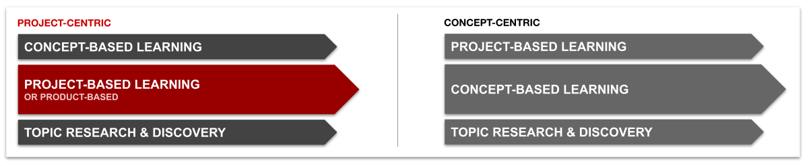
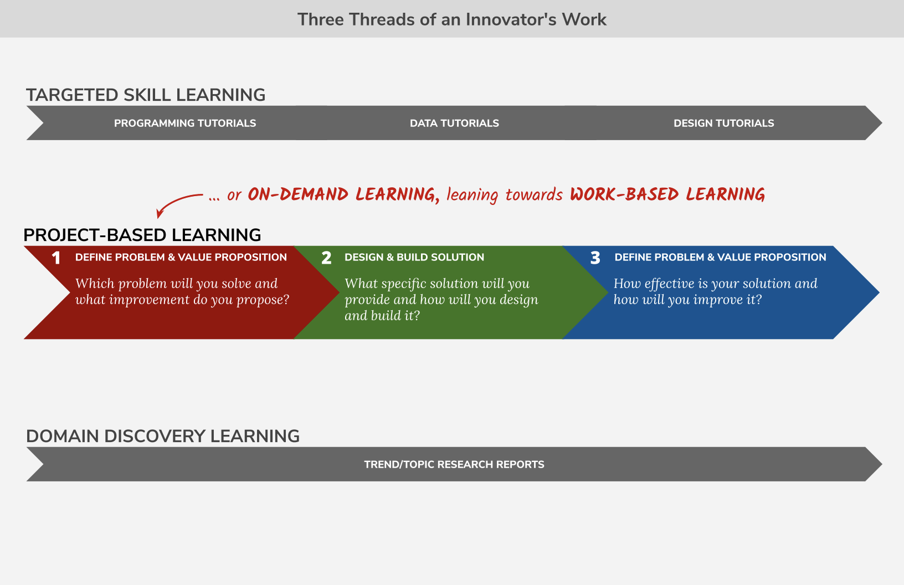

# Module 1 - Introduction

## Welcome 👋

**Computing by Design** \(CxD\) is a collection of project guidebooks for use in middle school and high school computer science courses. In each project, student teams collaboratively design and build a solution to a problem within a particular context using a specific technology  — from chatbots to data visualizations.

For this workshop we will go through the **three phases of the** [**standard project outline**](https://docs.idew.org/the-cxd-framework/standard-project-outline) while addressing the similarities and differences among the **six detailed projects offered**. We will discuss how you can adapt the provided project instructions for your context or even substitute another technology within the project framework.

### Identify one \(or more\) of the six Computing by Design projects that you will use to follow along in this workshop. Access to each of the projects can be found on the page linked below. 👇👇👇



## The Computing by Design Approach



**Technical agility, collaborative know-how, and constant curiosity** are required traits to influence the modern world. We believe that K-12 learning \(and doing\) should reflect practices in industry, where deep collaboration and problem solving produce concepts that leverage the power of computing in a thoughtful way.

Six years after introducing the Computing by Design approach, the skills trend is still evident from research, like the Future of Jobs Report 2020 from the World Economic Forum.

**Source: The Future of Jobs Report, 20 October 2020, World Economic Forum**  
[https://www.weforum.org/reports/the-future-of-jobs-report-2020/in-full/infographics-e4e69e4de7](https://www.weforum.org/reports/the-future-of-jobs-report-2020/in-full/infographics-e4e69e4de7)





**Student preparation for innovative work should include the following elements.** Notice the consistency with a professional's ongoing activities.

1. **Technical Skill** - Students must develop a particular skillset that provides value to teams. While students will engage three domains -- programming, data/business analysis, and design -- we advocate building a deeper expertise in at least one of the three domains. Continuous improvement of skills is a life-long pursuit. 
2. **Collaboration Skills** - Students must learn to contribute to solutions in teams. An individual's technical capacity can flourish or flail depending on team dynamics. Supporting authentic collaboration at schools is a focus of the Computing by Design framework.
3. **Broad Domain Awareness** - Students must maintain a clear awareness of careers and technological trends in order to identify opportunities and interests in a changing world. We encourage students to create reports on trends and careers in technology, as well as getting first-hand exposure to professionals through in-class visitors and field trips to industry.  

**Computing by Design \(CxD\) is a framework for** _**project-based learning**_, providing student teams direction and support for solving problems in a particular context. Each project complements parallel activities for students to build technical expertise and explore related technical trends.

CxD projects allow students to engage technological development using an interdisciplinary perspective. **Students develop skills and envision their unique voice** in producing novel solutions, whether through **code, data, or interaction design**. Each project directs students to consider the larger context of development, thoughtfully creating systems that meet valued goals.




**Each CxD project involves a sequence of three phases, each having its own driving question to help guide students towards solving the larger challenge.** The the listed tasks can be applied generally across different problem domains or technologies, but each will be tailored for the particular problem context. Each phase culminates in a presentation of a team's results for that phase.

### 1. DEFINE PROBLEM & VALUE PROPOSITION

_**Driving Question:**_  **Which problem will you solve and what improvement do you propose**_**?**_

* [ ] **Problem Definition & Importance** Analyze and describe the problem context and stakeholders.
* [ ] **Technology Experimentation & Summary** Understand the available resources and technology that may be part of your solution.
* [ ] **Initial Ideas & Evaluation** Consider a diverse set of solutions and evaluate each for potential.
* [ ] **Existing Solution Analysis** Analyze and evaluate existing solutions and borrow or synthesize ideas.
* [ ] **Stakeholder Profiles & Narratives** Meet stakeholders and co-develop an accurate narrative about the problem and proposed solution.
* [ ] **Value Proposition & Potential Features Map** Define a compelling value proposition and the intended features of the solution.
* [ ] **PROPOSAL PRESENTATION** Present a succinct proposal and collect further feedback to inform the details of your design.

### 2. DESIGN & BUILD SOLUTION 

_**Driving Question:**_  **What specific solution will you provide and how will you design and build it**_**?**_

* [ ] **Prototypes** Generate several distinct prototypes that represent creative perspectives on the solution details.
* [ ] **Prototype Evaluations** Evaluate the prototypes internally with the team and with stakeholders to verify the results.
* [ ] **Features Map & System Logic** Determine the solution specifications, logic, and interactions.
* [ ] **Development Plan & Testing Milestones** Prioritize development tasks and determine a plan to incrementally test the solution.
* [ ] **Pilot Development & Testing** Execute the plan methodically with frequent team check-ins.
* [ ] **Plan for Launch & Promotion** Determine the key actions to launch your solution with high impact.
* [ ] **PILOT DEMONSTRATION** Demonstrate the pilot development with promotional plan and collect feedback from peers.

### 3. EVALUATE & REFINE SOLUTION 

_**Driving Question:**_  **How effective is your solution and how will you improve it**_**?**_

* [ ] **Pilot Evaluation** Further evaluate the pilot release with stakeholders.
* [ ] **Final Release Development** Review the evaluation results and prioritize the fixes and improvements.
* [ ] **Final Release Launch and Promotion** Launch the solution with a clear call to action through your promotion.
* [ ] **Poster Design** Present the best artifacts to share the development story.
* [ ] **Individual Reflections**  Reflect on the experience and the impact on your future.
* [ ] **Presentation Plan & Practice** Take the time to know your audience and delivery plan.
* [ ] **FINAL DEMONSTRATION & PRESENTATION** This is your time to show everybody what you have done and share your story.



## Innovation in the Classroom



At the heart of every **innovation** is a problem that must be solved for **stakeholders** that provides a **clear improvement** over current practices.




Innovators must be able to **think deeply** and shift gears between **analytical, creative, and decisive** thinking. Innovators must be able to act individually and cooperatively to succeed.









**Other resources to consider:** [https://trello.com ](https://trello.com/en-US), [https://miro.com](https://miro.com/)



The Computing by Design project framework provides several distinct opportunities for students to engage the broader community. Throughout the workshop consider how you can facilitate activities the bring students and the community together in authentic ways.





