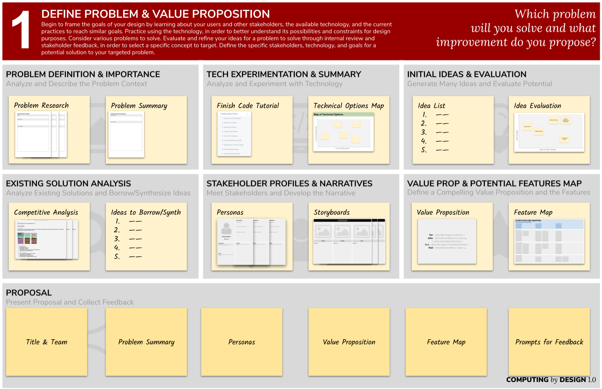

# Module 2 - Project Phase One

## DEFINING PROBLEMS & VALUE PROPOSITIONS

#### _**Driving Question for Students:**_  **Which problem will you solve and what improvement do you propose**_**?**_

Recall the **basic anatomy of a problem** discussed earlier...

In this phase students will develop **a model of the problem** through research and analysis, consider **a diverse set of ideas** for solving the problem, and then deliver **a proposal** for further development.

Each project will address the elements in the canvas below, often using very similar methods but **adapted for the context**.

Here is an **example canvas** with notes.

#### 👉 Check the ****[**google drive resources**](resources.md) for canvas templates you may want to use.

## **✓ Problem Definition & Importance │ ✓ Technology Experimentation & Summary**

### Identify the project activities that analyze and describe the problem context and stakeholders.

How might you define the project challenge? Will it be narrowly scoped or more open?  
How accessible are stakeholders and the problem context to the students?

### Identify the project activities that help students understand the available resources and technology that may be part of their solution.

How will you facilitate the tutorials or experiments with the programming and technology?  
How proficient will students need to be with the technology to begin defining the problem and ideas for solving it?

**Which CS standards are addressed in the identified activities for the project?** [**🔗IN CS Standards**](https://www.doe.in.gov/sites/default/files/wf-stem/ind-k-12-computer-science-standards.pdf)\*\*\*\*

### **General Purpose Resources**

* [_Interviewing Users_ from Nielsen Norman Group](https://www.nngroup.com/articles/interviewing-users/)

## **✓ Initial Ideas & Evaluation │ ✓ Existing Solution Analysis**

### Identify the activities that help students consider a diverse set of solutions and evaluate each for potential. 

How much time should you set aside for ideation? Will you give student's individual time to develop ideas and then facilitate group activities around those ideas? 

### Identify the activities that help students analyze and evaluate existing solutions and then borrow or synthesize ideas.

Will you have students do a competitive analysis or a slightly different approach? How might you discuss the incremental process of innovation that happens through competitive markets or published research?

**Which CS standards are addressed in these activities?** [**🔗IN CS Standards**](https://www.doe.in.gov/sites/default/files/wf-stem/ind-k-12-computer-science-standards.pdf)\*\*\*\*

### **General Purpose Resources**

* [Storyboards Help Visualize UX Ideas](https://www.nngroup.com/articles/storyboards-visualize-ideas/)
* [Etch A Sketch: How to Use Sketching in User Experience Design](https://www.interaction-design.org/literature/article/etch-a-sketch-how-to-use-sketching-in-user-experience-design) & [this video](https://www.youtube.com/watch?v=LskLyDOSfAc) &[ this video](https://www.youtube.com/watch?v=MwidSAlbEB8)
* [Sketch Templates for Phone, Tablet, and Desktop](https://drive.google.com/open?id=1Xq2I690nLybxSX_k1b0SKzcH40PCmbY3)
* [Decision matrix](https://www.nngroup.com/articles/prioritization-matrices/)

## **✓ Stakeholder Profiles & Narratives │ ✓ Value Proposition & Potential Features Map**

### Identify activities that help students meet stakeholders and co-develop an accurate narrative about the problem and proposed solution. 

How accessible are stakeholders and the problem context to the students? What methods \(surveys, virtual interviews, or in-class discussions\) do you foresee working in your context?

### Identify activities that help students define a compelling value proposition and the intended features of the solution.

How much detail will you expect in student proposals? How might you discuss the provisional nature of concept proposals, in that they can change as they learn more?

**Which CS standards are addressed in these activities?** [**🔗IN CS Standards**](https://www.doe.in.gov/sites/default/files/wf-stem/ind-k-12-computer-science-standards.pdf)\*\*\*\*

### **General Purpose Resources**

* [_Personas Make Users Memorable for Product Team Members_ from Nielsen Norman Group](https://www.nngroup.com/articles/persona/).
* [Persona Template](https://drive.google.com/open?id=1osCQyHANhkd-mhSi3pqS-eDHLCoJ6HWfLkiK4UPMOkI)
* [Value Propositions](https://docs.idew.org/principles-and-practices/practices/design-practices/value-proposition)
* [Feature Mapping Template](https://docs.google.com/drawings/d/1OEoQqVJDBLXdPB3JnsXv3474TWtEQ7uTLy_Pfs-y18Q/edit?usp=sharing) ★

## **★ PROPOSAL PRESENTATION**


### We recommend that you complete an example proposal as one of the three artifacts for the [workshop final deliverable](workshop-deliverable.md).


### **What is your plan to help students present a succinct proposal and collect further feedback on their proposal?** 

Will students generate videos for review by others?  Might you facilitate on live video conference? Could you coordinate an in-class event?

**Which CS standards are addressed in creating the proposal?** [**🔗IN CS Standards**](https://www.doe.in.gov/sites/default/files/wf-stem/ind-k-12-computer-science-standards.pdf)\*\*\*\*

### **General Purpose Resources**

* [_7 TIPS FOR PROPOSALS, PITCHES AND PRESENTATIONS_](https://www.americanexpress.com/us/small-business/openforum/articles/7-tips-for-proposals-pitches-and-presentations/)
* [Example slides](https://docs.idew.org/principles-and-practices/practices/design-practices/concept-proposals#examples) for a proposal
* [Student work galleries](https://galleries.idew.org) \(Look for "Proposal" galleries\)

