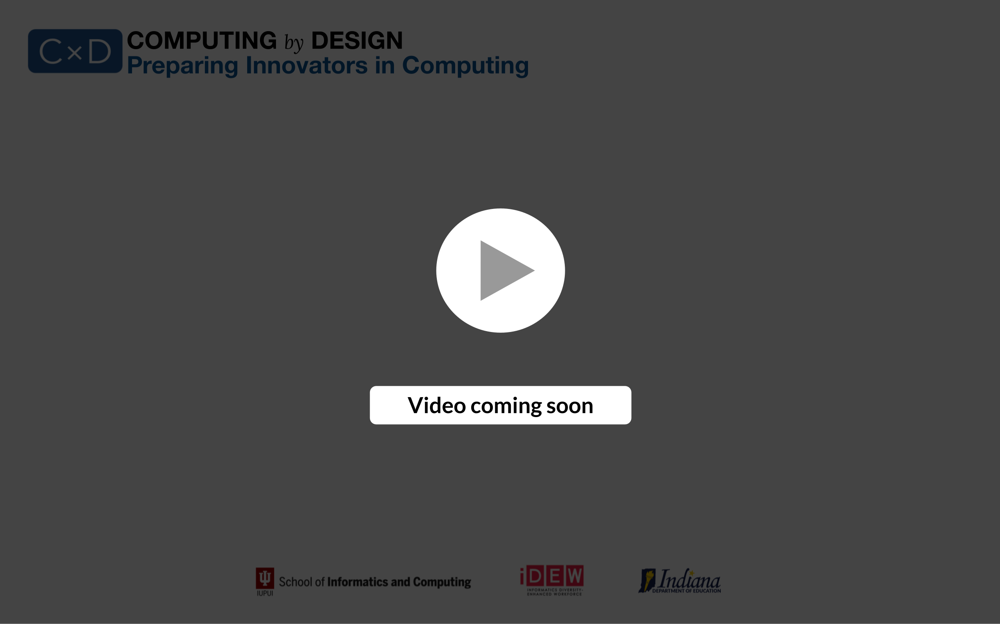

# Module 3 - Project Phase Two

## DESIGNING & BUILDING SOLUTIONS

#### _**Driving Question for Students:**_  **What specific solution will you provide and how will you design and build it**_**?**_





### **A Repeating Pattern**

Once again, students will apply the analyze, create, and deliver cycle, but with an increased fidelity of the solution. In this phase students will **analyze the feedback from the proposal**, consider **a set of prototypes** that define more detail in their solution, and then deliver **a specification** for further further development — usually to begin the actual programming and building.

"While it does typify the design process as a whole, in practice **the elaboration and reduction process must be continuously repeated** time and again throughout the course of design. From information architecture, to visual design, to the functional prototype, each stage must be explored in full, then lovingly honed down to a precise solution." - **​**[**Tyler Tate \(Concerning Fidelity in Design on UX Booth\)**](https://www.uxbooth.com/articles/concerning-fidelity-and-design/)

👉 Check the [google drive resources](https://app.gitbook.com/@cxd/s/cxd2021/~/drafts/-Mc6CcVPhzSbz-yz1ZuI/cxd-innovation-workshop/resources/~/settings/customization) for canvas templates you may want to use.


### **Evaluation is central to every aspect of any development. In the video below,** Dr. Aqueasha Martin-Hammond provides insights on evaluation and the techniques available to you and students for evaluation.




\*\*\*\*

\*\*\*\*

##  **✓ Prototypes │ ✓ Prototype Evaluations**

#### PROMPTS TO CONSIDER FOR SLACK CONVERSATION  

### Generate several distinct prototypes that represent creative perspectives on the solution details. 

How many distinct prototypes might you request from students? What tools will students be able to use to create prototypes? How much fidelity \(detail\) might you require at this stage? 

### Evaluate the prototypes internally with the team and with stakeholders to verify the results.

How will students conduct evaluations? Will there be another set of prototypes or will you have students conclude prototyping after one round?

**Which CS standards are addressed in the identified activities for the project?** [**🔗IN CS Standards**](https://www.doe.in.gov/sites/default/files/wf-stem/ind-k-12-computer-science-standards.pdf)\*\*\*\*

#### **GENERAL PURPOSE RESOURCES**

* [**Thinking Aloud** **from Nielsen Norman Group**](https://www.nngroup.com/articles/thinking-aloud-the-1-usability-tool/)
* **​**[**Concerning Fidelity in Design on UX Booth**](https://www.uxbooth.com/articles/concerning-fidelity-and-design/) **by Tyler Tate**
* [**Marvel App for Screen Interface Prototyping**](https://marvelapp.com/)\*\*\*\*


### We recommend that you create an example prototype as one of the three artifacts for the [workshop final deliverable](workshop-deliverable.md).


## **✓ Features Map & System Logic │ ✓ Development Plan & Testing Milestones**

#### PROMPTS TO CONSIDER FOR SLACK CONVERSATION  

### Determine the solution specifications, logic, and interactions. 

Will you use a story/feature map? How much detail will you expect from students as they determine what they will program and build? Will the use pseudo-code or another technique to get started?

### Prioritize development tasks and determine a plan to incrementally test the solution.

How do you want students to plan the development? How will they track progress and communicate that to you?

**Which CS standards are addressed in the identified activities for the project?** [**🔗IN CS Standards**](https://www.doe.in.gov/sites/default/files/wf-stem/ind-k-12-computer-science-standards.pdf)\*\*\*\*

#### **GENERAL PURPOSE RESOURCES**

* \*\*\*\*[**Planning with Pseudo-code**](https://www.khanacademy.org/computing/computer-programming/programming/good-practices/pt/planning-with-pseudo-code)\*\*\*\*
* [**A Quick Guide on Story Mapping**](https://www.lucidchart.com/blog/how-to-create-a-user-story-map)\*\*\*\*
* \*\*\*\*[**Story/Feature Mapping Template**](https://docs.google.com/drawings/d/1OEoQqVJDBLXdPB3JnsXv3474TWtEQ7uTLy_Pfs-y18Q/edit?usp=sharing)\*\*\*\*

## **✓ Pilot Development & Testing  │ ✓ Plan for Launch & Promotion**

#### PROMPTS TO CONSIDER FOR SLACK CONVERSATION 

### Execute the plan methodically with frequent team check-ins. 

How frequent will the check-ins be? What might trigger an intervention to get teams back on track?

### Determine the key actions to launch your solution with high impact.

How will the projects be promoted to the broader community? How much time and resources be dedicated to the promotion?

**Which CS standards are addressed in the identified activities for the project?** [**🔗IN CS Standards**](https://www.doe.in.gov/sites/default/files/wf-stem/ind-k-12-computer-science-standards.pdf)\*\*\*\*

## **★ PILOT DEMONSTRATION**

#### PROMPTS TO CONSIDER FOR SLACK CONVERSATION 

### Demonstrate the pilot development with promotional plan and collect feedback from peers.

How will students demonstrate pilot builds — live video, recorded video, or in-person? How will you direct students to prompt for feedback?

**Which CS standards are addressed in the identified activities for the project?** [**🔗IN CS Standards**](https://www.doe.in.gov/sites/default/files/wf-stem/ind-k-12-computer-science-standards.pdf)\*\*\*\*

