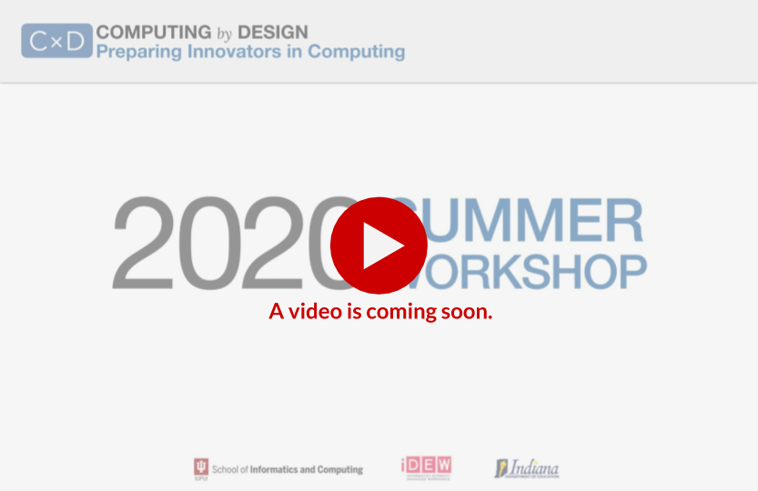

# Mapping Innovative Practices

We will map the **thinking, doing, and interactions of innovation** to provide perspective on the set of practices we want students to engage that provide a depth and breadth to their approach. We will investigate the **Indiana standards in computer science**, along with the **national framework** and **PBLWorks guidance,** to build confidence and comfort in covering a full spectrum of learning objectives.

### Prompts for Discussion \(on Slack \#cohort\*-module1-foundations\)

* How might you facilitate a _reflective practice_ with students to intentionally apply the different modes of thinking, doing, and interacting?
* Which of the practices discussed do you think will be most difficult to facilitate? Any potential ideas to improve outcomes?

### Module Material











**More:**  [**CS Standards Spreadsheet**](https://docs.google.com/spreadsheets/d/1NX5hL3benDO9Ruo85qzssl6qO0L2v6Ae2jEJlGQd6JU/edit?usp=sharing)\*\*\*\*

### \*\*\*\*[**Quick Access to Workshop Google Drive**](https://drive.google.com/drive/folders/1Nrld3kQRgsxm2J173ANdN0lNNCrbPhh4?usp=sharing)\*\*\*\*



\*\*\*\*

