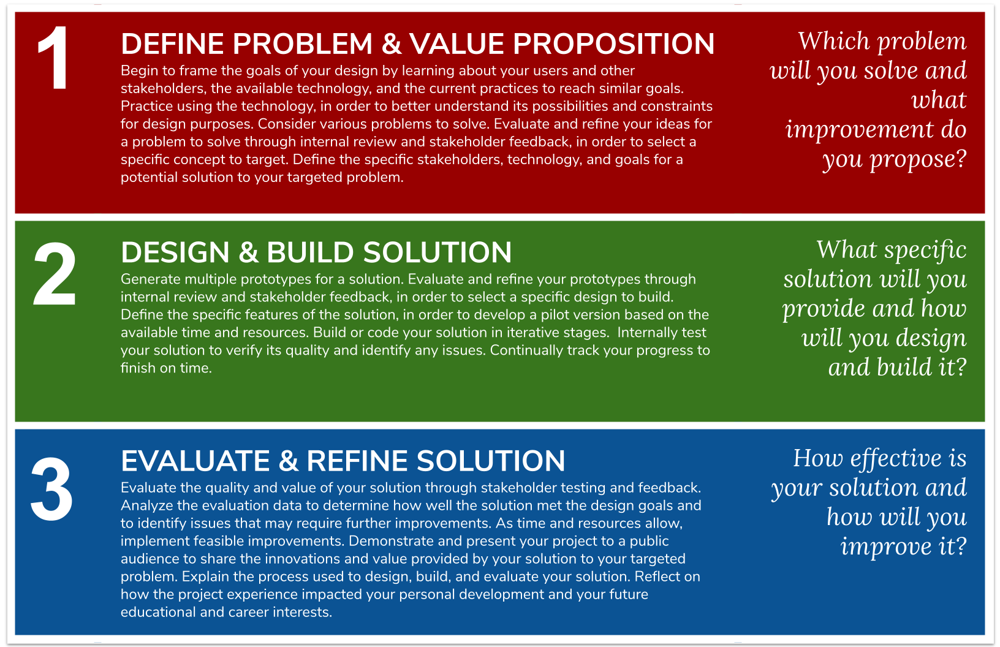

# Workshop Prep

## Background and Recommended Classroom Approach



### Background on Computing by Design Framework

**This workshop is focused squarely on the programming component of a CxD Project.** For a little bit of background, you will find that the Computing by Design framework is project-centric in the approach. 

Each project has three phases, where programming is a very important component of all three. **Our** [**Innovation Workshop**](../../cxd-innovation-workshop/full-experience.md) **covers the breadth of the Computing by Design framework.** We have found that the programming in any project presents a fine line between a wonderfully empowering experience \(when students struggle and get things working\) and a sometimes frustrating experience that becomes a missed opportunity. Therefore we are offering these programming workshops to provide a solid foundation on building the applications.

### Learning to Program: A Two-Pronged Approach

**We encourage you to offer students a two-pronged approach to learning to program.** Computing by Design projects provide an _**"application first"**_ approach to programming where students are provided direct guidance on creating a specific type of application through templates and tutorials -- like with trivia , a chatbot, IoT etc. This approach complements the many great tutorials available online that provide a _**"concept first"**_ approach by stepping through concepts in programming. Facilitating both approaches for students provides a varied experience -- strengthening knowledge and offering more opportunities to ignite interests. 


**Identify an online tutorial site that you can use in your classroom to supplement any project work.** Over the course of the workshop try out a few basic online programming tutorials from popular sites to facilitate this _"concept first"_ approach, and consider how you might manage a self-paced assignment based on milestones.  How might you use these self-guided tutorials as "filler time" or dedicate scheduled time to their completion?


## Getting Started with Slack

## Getting Started with Particle Build Editor

## Getting Started with Replit

