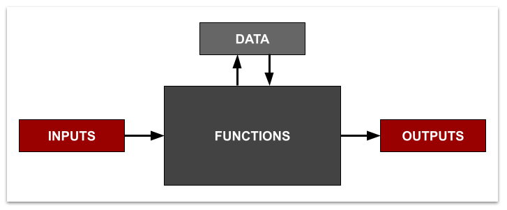

# Programming Concepts ⏱

## **The Big Picture**

**A program can be defined simply as** _**a set of instructions that perform defined tasks,**_ and we can use the  diagram below to frame the major components of a program. A program can be written to accept particular _**inputs,**_ like a mouse click, sound from a microphone, or a reading from a temperature sensor. The same program can handle the storage and retrieval of _**data**_, like _to do_ items or historical temperature data. The same program can then **output** something useful, like a current _to do_ list or move robot wheels. Multiple _**functions**_ are written to control and process everything towards some useful end, each function handling a particular task.


**Consider planning an in-class activity where students diagram a computing application** \(whether a social app, an AI driven tractor, or a video game console\). Have them consider what inputs, data, and outputs the program includes. While the students will not know exactly how the engineers designed the application, they can come up with some specific function names to guess how the application processes the information. For example, a phone may have a **function** called "changeScreenBrightness" that takes the light sensor **input** to update the screen's brightness \(**output**\) based on a stored user preference \(**data**\).


#### Programming Languages

This exercise will use **JavaScript**, the primary programming language for web applications that work in a standard browser. There are many other popular programming languages. A particular language is chosen for implementation based on several factors related to the context of the need. Here are a few you may have heard of -- **Python, Java \(different from JavaScript!\), Arduino, C++ and C\#**. 

## Let's Program: Variables, Functions, and Conditionals

This introduction takes a direct approach to preparing you for programming the CxD projects, and therefore takes an _"application first"_ perspective. **We will frame this introduction by starting a very simple** _**To Do Application**_**.** 

## Arrays and For Loops

...

## HTML and Events

...

## CSS

...

## Going Further

...

